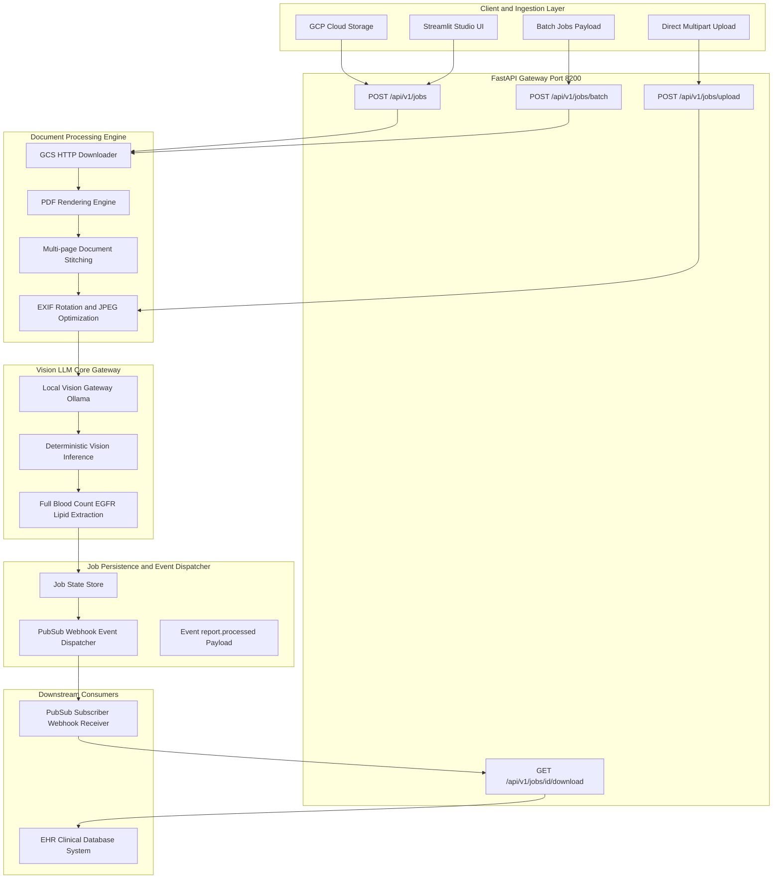
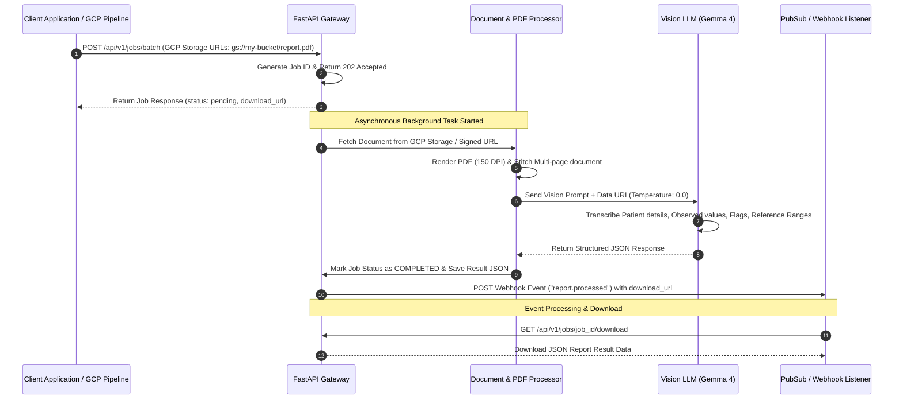

# 🩺 Medical Report OCR & Vision AI Architecture (A-Z Data Flow Guide)

## 📌 Executive Overview

This system is an enterprise-grade **Medical Lab Report OCR & Vision AI Data Extraction Pipeline**. It is designed to ingest lab reports (PDF documents or image scans) directly from **GCP Cloud Storage (`gs://` or GCS Signed URLs)**, HTTP public endpoints, direct file uploads, or Base64 URIs.

It processes single or batch medical report jobs asynchronously, performs **1-to-1 print-level visual verification** using local Vision LLMs (Gemma 4 / Qwen 3.5), stores structured JSON outputs, and emits completion events via **PubSub / Webhooks** so downstream services can download the results immediately.

---

## 🎨 Visual System Architecture Sequence Diagram


### Text Diagram Representation
========================================================================================================
                                🩺 END-TO-END OCR & VISION AI SYSTEM ARCHITECTURE
========================================================================================================

 [1. INGESTION SOURCE]               [2. FASTAPI GATEWAY]               [3. DOCUMENT ENGINE]
 ┌──────────────────────┐            ┌──────────────────────┐           ┌──────────────────────┐
 │ GCP Cloud Storage    │            │ POST /api/v1/jobs    │           │ GCS/HTTP Downloader  │
 │ (gs://... / GCS Link)│───────────>│                      │──────────>│ (httpx)              │
 └──────────────────────┘            │                      │           └──────────┬───────────┘
 ┌──────────────────────┐            │ POST /api/v1/jobs/   │                      │
 │ Batch URLs Payload   │───────────>│      batch           │                      ▼
 │ (Array of GCS links) │            │                      │           ┌──────────────────────┐
 └──────────────────────┘            │                      │           │ PDF Rendering Engine │
 ┌──────────────────────┐            │ POST /api/v1/jobs/   │           │ (pypdfium2 / PyMuPDF)│
 │ Multipart File Upload│───────────>│      upload          │           └──────────┬───────────┘
 │ (PDF / Image scan)   │            └──────────────────────┘                      │
 └──────────────────────┘                       │                                  ▼
                                                │                       ┌──────────────────────┐
                                                │                       │ Multi-Page Stitcher &│
                                                │                       │ Image Optimizer      │
                                                │                       └──────────┬───────────┘
                                                │                                  │
                                                ▼                                  ▼
 [6. DOWNSTREAM CONSUMER]            [5. EVENT DISPATCHER]              [4. VISION LLM CORE]
 ┌──────────────────────┐            ┌──────────────────────┐           ┌──────────────────────┐
 │ EHR / Clinical DB    │            │ PubSub / Webhook     │           │ Local Vision Gateway │
 │ System               │<───────────│ Event Notification   │<──────────│ (Ollama Gemma 4)     │
 └──────────▲───────────┘            │ ("report.processed") │           │ (Temp: 0.0)          │
            │                        └──────────────────────┘           └──────────────────────┘
            │                                   │
            └───────────────────────────────────┘
              GET /api/v1/jobs/{job_id}/download
========================================================================================================
```

---

## 🏗️ 1. End-to-End System Architecture (Flowchart)



---

## 🔄 2. Complete Dataflow Sequence (A-Z)



---

## ⚙️ 3. Detailed Component Architecture

### 📥 Component 1: Ingestion & GCP Cloud Storage Layer
- **GCP Cloud Storage Normalization**: Automatically converts `gs://bucket-name/object.pdf` into authenticated/signed or storage API URLs (`https://storage.googleapis.com/bucket-name/object.pdf`).
- **Batch Processing (`POST /api/v1/jobs/batch`)**: Accepts an array of GCS document URLs in a single request. Each item is queued into an asynchronous non-blocking job.

### 📄 Component 2: Document Rendering & Image Processor (`app/services/image_processor.py`)
- **PDF Detection**: Inspects magic bytes (`%PDF`).
- **Rendering Engine**: Renders PDF pages using `pypdfium2` or `PyMuPDF` at 2x scale (~150 DPI) for maximum numeric clarity.
- **Multi-page Stitching**: Stitches multi-page PDF documents vertically into a combined PIL Image stack.
- **Image Optimization**: Auto-corrects EXIF rotation, converts RGBA to RGB JPEG, and resizes large scans to optimal vision resolution (e.g. 1280px).

### 🧠 Component 3: Vision LLM Processing Engine (`app/services/llm_client.py`)
- Interfaced to local Vision Gateway on ports `11434` (Ollama) or `8100` (llama.cpp) running **Gemma 4 / Qwen 3.5**.
- Uses deterministic extraction (`temperature=0.0`) for exact number and decimal point precision.
- **1-to-1 Verification**:
  - Handles missing/unreported observed values (recording empty string `""` or `"N/A"`).
  - Captures complex reference ranges (e.g. multi-line Lipid risk classifications).
  - Extracts custom clinical tables (e.g. `AGE AVERAGE ESTIMATED GFR` grids in EGFR reports).

### 💾 Component 4: State Management & Result Persistence (`app/services/job_service.py`)
- Concurrent in-memory job registry with thread-safe asyncio locks.
- Assigns unique job identifiers (`job_a1b2c3d4e5f6`).
- Exposes direct download endpoints (`GET /api/v1/jobs/{job_id}/download?format=json`).

### 📢 Component 5: Event PubSub & Webhook Engine
- Once job processing completes (or fails), dispatches an HTTP POST event payload to the client's `webhook_url`.
- Downstream PubSub subscribers receive the notification containing the `job_id`, status, metadata, and direct result `download_url`.

---

## 📑 4. API Endpoints & Request Specifications

### A. Single Document Job (`POST /api/v1/jobs`)
```json
{
  "document": "gs://my-lab-bucket/reports/2026-08/patient_18353.pdf",
  "prompt": "Perform an exact line-by-line verification check of all values in this report against the printed document.",
  "system_prompt": "You are a High-Precision Medical Report Verification AI.",
  "webhook_url": "https://pubsub-listener.internal.company.com/events",
  "meta": {
    "patient_id": "18353",
    "facility": "Main Lab"
  }
}
```

### B. Batch Document URLs (`POST /api/v1/jobs/batch`)
```json
{
  "documents": [
    {
      "document": "https://storage.googleapis.com/my-lab-bucket/FBC.pdf",
      "meta": { "sample_id": "S101" }
    },
    {
      "document": "https://storage.googleapis.com/my-lab-bucket/EGFR.pdf",
      "meta": { "sample_id": "S102" }
    },
    {
      "document": "https://storage.googleapis.com/my-lab-bucket/LIPID_PROFILE.pdf",
      "meta": { "sample_id": "S103" }
    }
  ],
  "webhook_url": "https://pubsub-listener.internal.company.com/events"
}
```

### C. Webhook Event Payload (`report.processed`)
```json
{
  "event_type": "report.processed",
  "event_id": "evt_9a4f21b7c8e",
  "timestamp": "2026-08-13T10:35:00Z",
  "data": {
    "job_id": "job_3e981f2a4",
    "status": "completed",
    "created_at": "2026-08-13T10:34:45Z",
    "completed_at": "2026-08-13T10:35:00Z",
    "download_url": "http://localhost:8200/api/v1/jobs/job_3e981f2a4/download",
    "meta": {
      "batch_id": "batch_7a2b9c",
      "sample_id": "S101"
    },
    "result": {
      "patient_info": {
        "patient_name": "MISS TOPH",
        "pid_no": "18353",
        "age": "20 Years",
        "sex": "Female"
      },
      "report_title": "Full Blood Count",
      "investigations": [
        {
          "section": "Leucocytes",
          "investigation": "WBC Count",
          "observed_value": "3,000",
          "flag": "L",
          "unit": "cells / mm³",
          "reference_interval": "4,000 - 12,000"
        }
      ]
    },
    "error": null
  }
}
```

---

## 🛠️ 5. Running the Pipeline

1. **Start Ollama / Local LLM Server**:
   ```bash
   ollama serve
   ```
2. **Launch API & Streamlit Studio**:
   ```bash
   ./start_all.sh
   ```
3. **Run Batch Extraction Script on Sample PDFs**:
   ```bash
   python3 scripts/batch_extract.py
   ```
