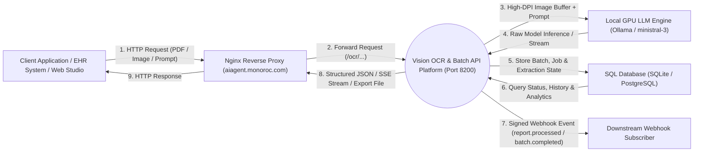
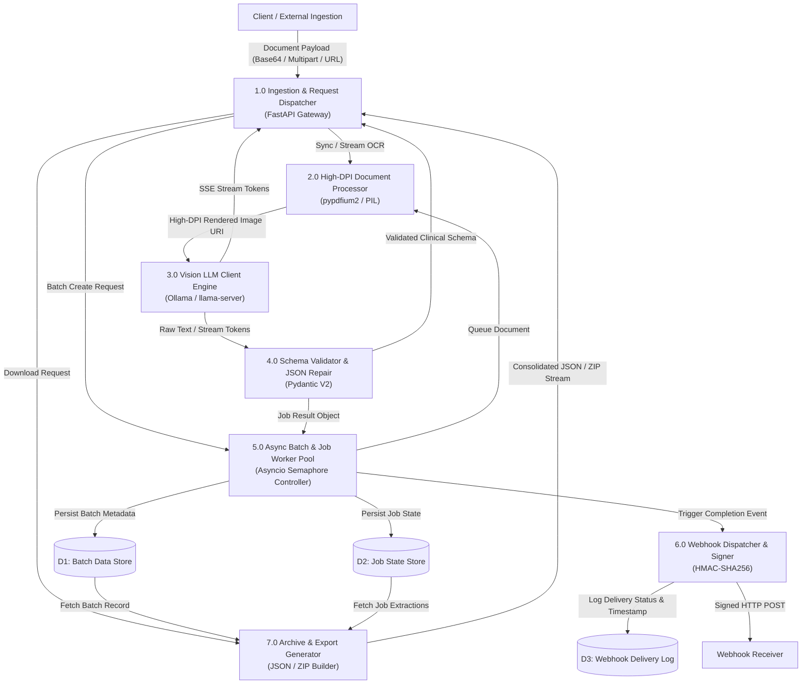
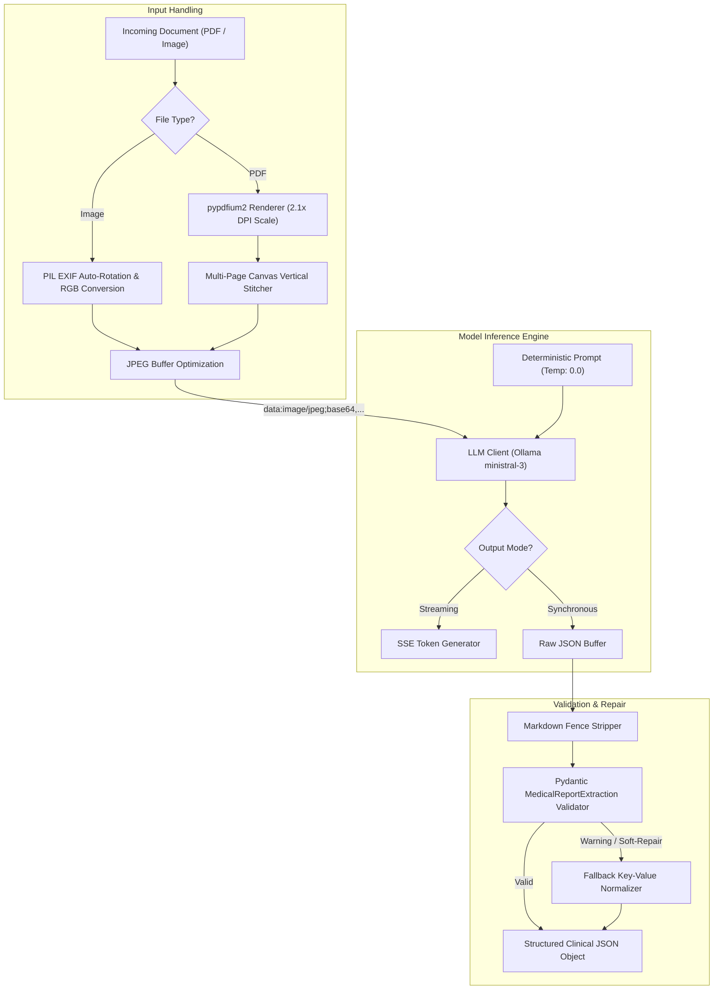
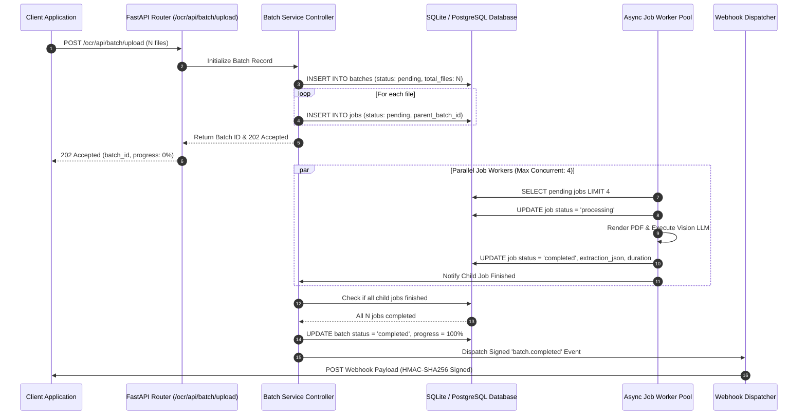

# System Data Flow Diagrams (DFD)

This document provides formal Level 0, Level 1, and Level 2 Data Flow Diagrams (DFDs) for the Vision OCR and Batch Processing Platform.

---

## 1. DFD Level 0: Context Diagram

The Context Diagram defines the system boundaries, external entities, primary inputs, and output data flows.

---

## 2. DFD Level 1: System Decomposition Diagram

The Level 1 Diagram illustrates the core sub-processes, internal data stores, and inter-component data exchanges.

---

## 3. DFD Level 2: Sub-Process Data Flow Diagrams

### 2.1 Sub-Process 2.0 & 3.0: Direct Vision OCR & Token Streaming Flow

---

### 2.2 Sub-Process 5.0: Asynchronous Multi-Document Batch Pipeline

